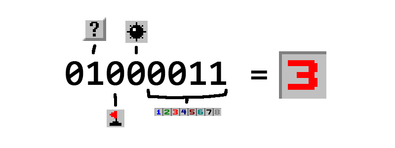

I decided to work on the client first, so I'd have something nice to look at. Minesweeper is a tile-based 
game, so you may find the methods here useful for other tile-based games, or for drawing objects in general
when the view is moving around in the world.

## Representing tiles

If you're drawing a finite grid, you can store the tiles in a 2D array (an array of arrays). 

In minesweeper, there are a few properties that determine the game logic and sprite to draw:

- whether the tile is revealed (yes or no - 1 bit of information)
- whether the tile has a mine on it (1 bit)
- whether the tile has a flag on it (1 bit)
- how many adjacent mines there are (integer 0-8, 4 bits of information)

Which comes to 7 bits in total.

To keep our bandwidth low once we get to the networking stage, we can use a minimal representation of
this in the form of an 8 bit integer:



We can create and interpret these using bitwise operations:

```javascript
export const AdjacencyMask = 0b1111; // bits 0-3 = number of adjacent mines
export const Mine = 1 << 4; // bit 4 = is there a mine?
export const Flag = 1 << 5; // bit 5 = is this flagged?
export const Revealed = 1 << 6; // bit 6 = is this revealed?

export const adjacent = tile => tile & AdjacencyMask;
export const mine = tile => (tile & Mine) !== 0;
export const flag = tile => (tile & Flag) !== 0;
export const revealed = tile => (tile & Revealed) !== 0;
```

## Drawing tiles to the screen

I found a [fantastic sprite sheet](https://www.spriters-resource.com/pc_computer/minesweeper/sheet/19849/)
and edited it in photoshop to get a streamlined image:


Each tile is square, and the same size: 16x16, so we can use one value `tileSize` when drawing tiles.

This allows me to easily index into the image and draw the tile to the canvas like so:

```javascript
    const spriteIndex = getSpriteIndex(tile);
    const [x, y] = canvasCoords;
    context.drawImage(sprites, // source image
        spriteIndex * tileSize, 0, tileSize, tileSize, // left, top, right and bottom of the source
        x, y, tileSize, tileSize // left, top, right and bottom of the destination canvas
    );
```

To draw a grid of tiles, just multiply the tile's position in the 2D array by the tile size to get the canvas coordinate,
and iterate over all the tiles. This gets you a screen full of tiles, but there are some issues.

First, we only want to draw tiles to the screen if we have to. Calls to `context.drawImage` are expensive,
and we want the game to run at 60fps. Drawing tiles we don't see is silly. We want to 'cull' the tiles that won't show
up on the screen.

There is a bigger problem, however: we want an infinite grid, so there can be an arbitrary number of tiles we
can't see. We also need to be able to pan around the world to see different areas of the board.

Also, given that we're using an infinite grid, a 2D array isn't going to cut it. We would have to extend the array
as the world gets bigger, which would get very expensive as the size of the world increases. Let's solve this problem
first.

## Chunks

This is a concept that I borrowed from Minecraft, another game where the world can extend to an arbitrary
size.

Instead of dealing with one infinite grid, we can split the grid up into chunks: square grids of tiles of a fixed size,
such as 16x16. The chunks are stored in a hash table, indexed using a key that corresponds to the coordinates of the
chunk. If we want to find a tile, first we figure out the chunk coordinates:

```javascript
export const chunkCoords = ([x,y]) => {
    return [
        Math.floor(x/chunkSize)*chunkSize,
        Math.floor(y/chunkSize)*chunkSize
    ];
}
```

i.e. we refer to chunks using the coordinate of their top left corner. `Math.floor(x/chunkSize)` finds the x number of
the chunk, so the chunk at (0,0) would have x number 0, and the chunk at (chunkSize, 0) would have x number 1. Then we
multiply by chunkSize to get the x position of the chunk. The same is done for y.

Inside the chunk, I use a 1D array, and calculate the index of a tile like so:

```javascript
indexOf(worldCoords) {
    const row = Math.floor(worldCoords[1]) - this.coords[1];
    const col = Math.floor(worldCoords[0]) - this.coords[0];
    if (row >= chunkSize || col >= chunkSize || row < 0 || col < 0) {
        return -1;
    }
    return row*chunkSize + col;
}
```

This is a method on the Chunk object I made. 
You can check out the full code for that [here](https://github.com/bogoblin/onlinesweeper/blob/3af679221cc7b067d47a57388dcb82a19b109a56/shared/Chunk.js).

## Screen space and world space

Each tile on our board has an integer x and y coordinate in *world space*. However, the canvas we're drawing
to doesn't understand world space, we need to give our coordinates in *screen space*.

Canvas coordinates go from (0,0) in the top left, to (canvas.width, canvas.height) in the bottom right. This
is in contrast to cartesian coordinates, where the y value increases in the opposite direction. To keep things
simple, my coordinates in the minesweeper world will do the same.